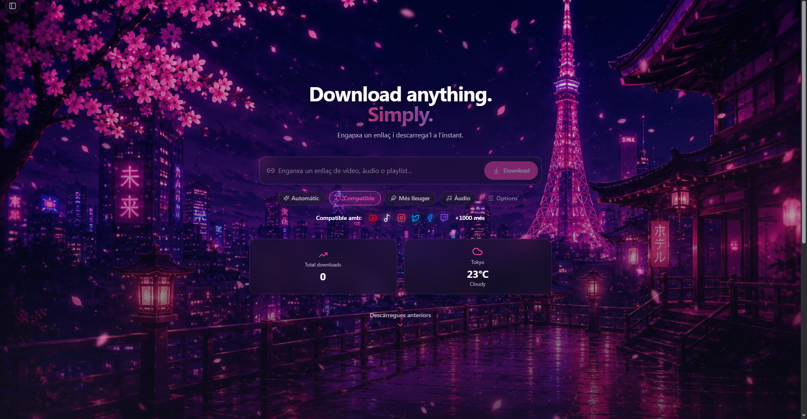
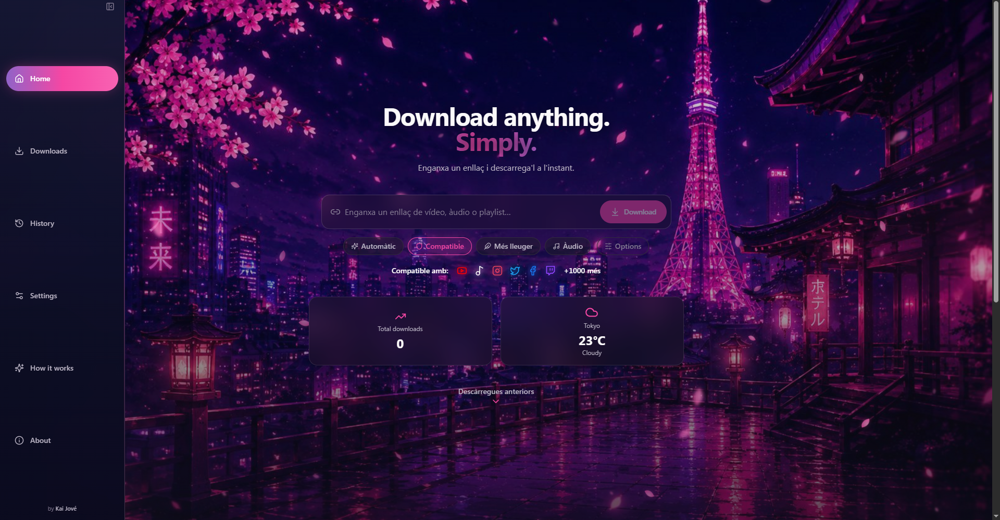
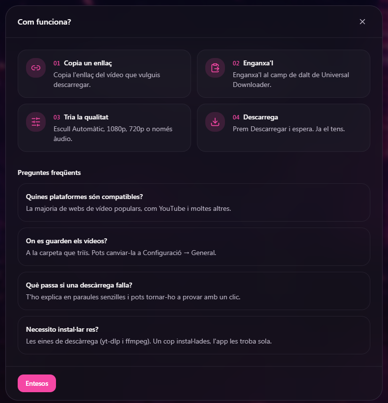
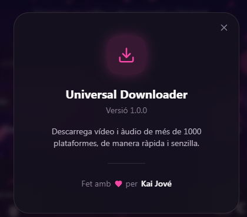

<div align="center">

  

  <h1>Universal Downloader</h1>

  <p><strong>Download anything. Simply.</strong></p>
  <p>A beautiful, fast and modern desktop downloader for video and audio from the web.</p>

  <br />

  
  
  
  
  
  

  <br /><br />

  <strong>⚡ Fast</strong> &nbsp;•&nbsp;
  <strong>🎨 Beautiful</strong> &nbsp;•&nbsp;
  <strong>🎵 Video & Audio</strong> &nbsp;•&nbsp;
  <strong>🖥️ Desktop</strong>

</div>

---

## ✨ What is it

Universal Downloader turns downloading media from the web into a **paste-and-go** experience — no terminal, no `yt-dlp` flags to memorize. Paste a link, pick a quality, and download.

Under the hood: **yt-dlp** + **FFmpeg**, wrapped in a **Tauri + Rust + React** desktop app.

## 🚀 Try it instantly

**Windows:** just run the `.exe` — no dev environment needed. If it says `yt-dlp`/`ffmpeg` is missing, see [Requirements](#-requirements) or `Settings → Developer`.

## 👀 Preview

<div align="center">
  
  <br /><br />
  
</div>

## 🧠 How it works

<div align="center">
  
</div>

1. 🔗 **Paste a link** — video, audio or playlist.
2. 🔎 **Auto-detect** — `yt-dlp` fetches title, thumbnail, duration, formats.
3. 🎛️ **Pick a preset** — Best, Best compatible, Smallest, Audio-only, or go custom.
4. 💬 **Subtitles** — download or embed, including auto-generated ones.
5. ⬇️ **Queue & progress** — live speed, ETA and stage (`Downloading → Merging → Finalizing`).
6. ⏯️ **Full control** — pause, resume, cancel or retry any download.
7. 🕘 **History** — every finished download is kept and searchable.

## 🎯 Features

| | |
|---|---|
| 🔗 Paste-and-go | Drop a link, metadata resolves automatically |
| 🎞️ Media preview | Thumbnail, title, uploader, duration, formats |
| 🎚️ Quality presets | Best · Compatible · Smallest · Audio · Custom |
| 📥 Real download queue | Configurable concurrency, auto-starts next in line |
| 📈 Live progress | Percentage, speed, ETA, current stage |
| ⏯️ Pause / resume / cancel / retry | Full control per download, with retry backoff |
| 🕘 Searchable history | Never lose track of what you downloaded |
| 🖥️ Desktop integration | Tray, start at login, drag & drop, clipboard watch, notifications |
| 🩺 Diagnostics | Inspect detected `yt-dlp`/`ffmpeg` versions and logs |
| 🎨 Animated UI | Tokyo-inspired design, smooth motion throughout |

## 🏗️ Tech stack

| Layer | Technology |
|---|---|
| 🦀 Backend | Rust |
| 🖥️ Desktop | Tauri 2 |
| ⚛️ Frontend | React 18 + TypeScript 5 |
| ⚡ Build | Vite 5 |
| 🧠 State | Zustand |
| 🎨 Styling | Tailwind CSS + Framer Motion |
| 📥 Engine | yt-dlp + FFmpeg |
| 🧪 Testing | Vitest (131 tests) |

<details>
<summary>🏛️ Project structure</summary>

```text
src/
├── app/            App shell, global subscriptions and overlays
├── core/engine/    Event bus, errors, persistence, URL resolvers
├── modules/
│   ├── downloads/  Queue, cards, actions, progress
│   ├── metadata/   Resolution, ranking, cache
│   ├── advanced/   yt-dlp args, templates, retry logic
│   ├── settings/   Settings store, migration, UI
│   └── desktop/    Tray, drag & drop, clipboard, notifications, updater
├── shared/         Reusable components and utilities
└── design-system/  Motion system and design tokens

src-tauri/src/      lib.rs · commands.rs · diagnostics.rs · tray.rs
```

> Business logic never lives inside UI components — it belongs in hooks, services and stores.

</details>

## 📦 Requirements

Node.js 20+ · pnpm 9+ · Rust stable · `yt-dlp` · `ffmpeg`

```bash
# Windows
winget install yt-dlp.yt-dlp Gyan.FFmpeg

# macOS
brew install yt-dlp ffmpeg

# Linux
pipx install yt-dlp && apt install ffmpeg
```

If a GUI build can't find them on `PATH`, set explicit paths in `Settings → Developer`.

## 🛠️ Development

```bash
pnpm install
pnpm tauri dev      # run in dev mode
pnpm check          # typecheck + lint + tests
pnpm tauri build    # production installer/bundle
```

## 📚 Docs

More detail lives in [`docs/`](docs/): architecture, build, settings, download/metadata engines, desktop integration, troubleshooting, FAQ.

## 🗺️ Roadmap

- Bundle `yt-dlp`/`ffmpeg` as app sidecars
- Enable the automatic updater
- First-class playlist downloading

## 🤝 Contributing & Security

See [`CONTRIBUTING.md`](CONTRIBUTING.md) (run `pnpm check` before submitting) and [`SECURITY.md`](SECURITY.md) for vulnerability reports.

## 📄 License

MIT — see [`LICENSE`](LICENSE). © 2026 Kai

---

<div align="center">



<h3>Made with ❤️ by Kai</h3>

🌸 Inspired by Tokyo &nbsp;•&nbsp; ⚡ Built with modern tech &nbsp;•&nbsp; ❤️ Made with care

<br /><br />

<sub>Universal Downloader — Download anything. Simply.</sub>

</div>
